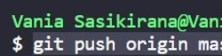

# Writing and Presentation Test Week 1 [19 sept s/d 25 sept]
## <h4>Nama     : Vania Sasikirana</h4><h4></h4>Group FE 2 - Kelompok 11</h4> <h4>Mentor : Thoriq Nur Faizal</h4>

### **<br>1. Unix Command Line**
- <b>Shell</b> merupakan sebuah istilah UNIX untuk melakukan command-line interfaces antara user maupun sistem. Bagaimana cara user berinteraksi langsung dengan komputer menggunakan bahasa yang berasal dari keyboard dan monitor. 
- <b>Command Line Interface</b> yang seringkali disingkat sebagai CLI. CLI ini merupakan sebuah wadah yang berguna agar pengguna dapat mengetik sebuah perintah teks yang memerintahkan komputer untuk melakukan tugas tertentu.

- <b>Cara mengakses CLI</b> menggunakan terminal
``` 
   1. Tekan tombol Windows + R, kemudian ketikkan "cmd" tanpa tanda kutip.
   2. Kemudian cara kedua kita bisa mengakses CLI menggunakan tipe BASH pada Visual Studio Code, caranya tekan tombol "CTRL + SHIFT + '". Kemudian ubah Terminal yang tadinya masih "PowerShell" menjadi "bash" pastikan kita sudah mendownload GIT Bash terlebih dahulu.
```
- <b>File System Structure</b> merupakan sebuah struktur yang dapat digunakan untuk mengendalikan seluruh akses terhadap data yang berada di sebuah disk. <b>File Sistem</b> ini berfungsi atas penyimpanan segala data maupun program yang di kendalikan oleh Sistem Operasi dan juga Sistem Komputer.
 
 - Cara Melihat <b>Current working directory</b> pada CLI.
 

``` 
   1. Pertama masuk kedalam CLI Bash kemudian jika sudah berhasil maka akan muncul tanda Dollar atau "$".
   2. Ketikkan "pwd" tanpa tanda kutip. PWD disini memiliki arti Print Working Directory, dimana ia akan menampilkan output posisi direktori kita yang aktif saat ini.

```
 - Cara Melihat <b>Isi Direktori</b>.


``` 
   1. Pertama masuk kedalam CLI Bash kemudian jika sudah berhasil maka akan muncul tanda Dollar atau "$".

   2. Ketikkan "ls" tanpa tanda kutip. ls ini memiliki arti list dimana perintah ini akan menampilkan output berupa isi yang terdapat pada direktori yang sedang aktif saat itu juga.
```
- Cara <b>Berpindah Direktori</b><br>
 

``` 
   1. Pertama masuk kedalam CLI Bash kemudian jika sudah berhasil maka akan muncul tanda Dollar atau "$".

   2. Ketikkan "cd namadirektori". Perintah cd merupakan singkatan dari Change Directory, dimana perintah cd ini berfungsi untuk memindahkan direktori yang aktif ke direktori lainnya lagi.
```

- Cara <b>Melihat isi File</b>
 

``` 
   1. Pertama masuk kedalam CLI Bash kemudian jika sudah berhasil maka akan muncul tanda Dollar atau "$".

   2. Lalu masuk kedalam direktori yang ingin kita buka isi file .txt nya dengan perintah cd direktori.

   3. Ketikkan "cat namafile.txt". Perintah cat dapat digunakan untuk melihat isi dari sebuah file, dan juga dapat menambahkan isi atau value dari sebuah file.
```

- Cara <b>Membuat File dan Direktori</b>
 
 


``` 
   1. Pertama masuk kedalam CLI Bash kemudian jika sudah berhasil maka akan muncul tanda Dollar atau "$".

   2. Lalu masuk kedalam direktori yang ingin kita buka dengan perintah "cd direktori".

   MKDIR :
   - Ketikkan "mkdir namadirektori". Perintah mkdr dapat digunakan untuk membuat sebuah direktori baru.
   
   TOUCH :
   - Ketikkan "touch namafile.txt". Perintah touch dapat digunakan untuk membuat sebuah file.
```
- Cara <b>Menyalin File dan Direktori</b>
 
 


``` 
   1. Pertama masuk kedalam CLI Bash kemudian jika sudah berhasil maka akan muncul tanda Dollar atau "$".

   2. Lalu masuk kedalam direktori yang ingin kita buka dengan perintah "cd direktori".

   ----- CP -----
   - Untuk menyalin file atau direktori dapat menggunakan 1 perintah yaitu "cp" hanya saja perbedaannya ada pada perintah "-r"
   
    ---- File ----

       cp wp1.txt m1a   -> Perintah ini akan memerintahkan bahwasannya FILE bernama wp.txt yang berada di direktori aktif tersebut akan dipindahkan ke dalam folder m1a.

    ---- Direktori ----

       cp -r m1a m1b    -> Perintah ini akan memerintahkan bahwasannya SELURUH file pada direktori m1a(termasuk direktorinya itu sendiri) akan di salin ke dalam direktori bernama m1b. 
    
    R disini artinya Rekursif, dimana ia memiliki sifat "menyeluruh".

```


- Cara <b>Memindahkan dan Me-Rename File dan Direktori</b>
(Record videonya terhapus, jadi tidak bisa ss hasil Demo live nya kak maaf) Tapi saya alhamdulillah bisa dan lancar.
``` 
   1. Memindahkan dan Merename

   - Ketikkan "mv direktoriTarget direktoriTujuan". Perintah mv dapat digunakan untuk memindahkan direktori lama ke direktori lainnya.
   
```

- Cara <b>Menghapus File dan Direktori</b>
 
 


``` 
Menghapus :
   - Ketikkan "rm direktoriTarget". Perintah rm dapat digunakan untuk menghapus direktori.
   
```
### **2. Git dan GitHub Dasar**
- <b>Git</b> dan <b>GitHub</b> merupakan dua platform yang <b>wajib digunakan</b> dalam dunia perkodingan, alasannya karena <b>Git</b> sendiri mampu menyimpan riwayat perubahan-perubahan pada suatu file. Sementara <b>GitHub</b> merupakan sebuah wadah dimana kita menyimpan sebuah repository bilamana kitapun dapat mengolah kembali project yang akan di perbaharui.

- <b>Perbedaan Git dan GitHub</b> : Seperti yang sudah dijelaskan di atas bahwasannya <b>Git</b> dapat melakukan penyimpanan riwayat perubahan-perubahan pada suatu file dan <b>GitHub</b> merupakan sebuah wadah untuk menyimpan Project tersebut. Singkatnya ...
```
    Git     : Sistem kontrol untuk revisi
    GitHub  : Layanan Hosting untuk menyimpan segala macam 
    revisi tanpa harus menduplikasi secara boros file lama 
    menjadi baru 
```
- <b>Alur Kerja dari Git dan GitHub</b> :
    Pada dasarnya Git dan GitHub ini memiliki relasi atau hubungan, dimana saat kita melakukan berbagaimacam perintah command pada Git melalui perangkat lunak Visual Studio Code maka kita dapat langsung menyimpan kedalam repository pada GitHub nya itu sendiri.

- <b>Membuat Repository pada GitHub</b><br>


- <b>Melakukan Commit pada Git</b><br>


```
git add .
git commit -m ".."
```
- <b>Mempublish Project kedalam GitHub</b><br>


```
git remote add origin https://github.com/vaniaskirana/vaniaskirana.git
```

- <b>Melakukan Clonning pada Git</b>
```
    git clone HTTPS_repository kita : 

    git clone https://github.com/vaniaskirana/TPA-3-Fetch.git

```

- <b>Melakukan Push pada Git</b><br>


```
    git push origin main/main

    selesai
```

### **3. HTML** 
<br><b>Peran HTML pada web development</b>, pada dasarnya HTML ini memiliki fungsi sebagai kerangka dasar dalam membangun sebuah website yang akan didukung oleh CSS dan JavaScript nantinya. 
- <b>Tools pendukung pada HTML</b> : Text Editor seperti Visual Studio Code, Sublime Text, dan lainnya
- <b>Contoh HTML Sederhana</b> :
```
<!DOCTYPE html>
<html lang="en">

    <head>
        <meta charset="UTF-8">
        <title>FrontEnd Web Development</title>
    </head>

    <body>
        <h1>Nama : Vania Sasikirana</h1>
        <p>Group FE-2 dan Kelompok FEBE11</p>
    </body>

</html>
```
- <b>Live Server HTML pada VisualStudioCode</b> : Live server bermaksud kita dapat merubah kodingan kita pada aplikasi vsc tanpa harus merefresh halaman muka website agar tampilannya menjadi lebih baru lagi.
- <b>Tag HTML yang Populer</b> : Tag pada HTML ada banyak sekali, Hapus tanda titik

    1. anchor <.a>       : Menghubungkan link.
    2. <.br>             : Membuat baris baru.
    3. <.div>            : Membungkus tag-tag di dalamnya menjadi 1 agar terstruktur.
    4. <.head>           : Sebagai wadah untuk menaruh konteks seperti <.title>.
    5. <.img>            : Memasukkan media berupa foto.
    6. <.p>              : Membuat Paraghraf baru.
    7. <.h1> s/d <.h6>   : Ukuran teks pada HTML.

<br>
- <b>Semantic HTML</b> : Pada HTML terdiri dari struktur yang berupa Header, Nav, Main, dan Footer.
<br>

Contoh <b>Implementasi</b> Tag dan Semantic HTML :

```
<!DOCTYPE html>
<html lang="en">

    <head>
        <meta charset="UTF-8">
        <title>FrontEnd Web Development</title>
    </head>

    <body>
        <h1>Nama : Vania Sasikirana</h1>
        <p>Group FE-2 dan Kelompok FEBE11</p>
        <a href="https://skilvul.com/">Visit Skilvul.com!</a>
        <br>
        

        
    </body>

</html>
```

- <b>Deployment</b> : Melakukan Deployment Pada Netlify.<br>


### **4. CSS**
- <b>Peran CSS terhadap Web</b>, CSS berperan untuk mempercantik tampilan website. Dimana ia akan menyelimuti kerangka yang telah dibuat oleh HTML sebelumnya.
- <b>3 Cara Menyisipkan CSS ke dalam HTML</b> :
    1. <b>Inline</b> CSS    : Kita memasukkan styling langsung di dalam file HTML nya kedalam tag yang bersangkutan.
   ```
  <body>
    <h1 style="color:pink;">Vania Sasikirana</h1>
  </body>
 
   ```

    2. <b>Internal</b> CSS  : Kita membuat styling di dalam HTML nya.
    <br>
    ```
    <!DOCTYPE html>
    <html>
     <head>
        <meta name="viewport" content="width=device-width, initial-scale=1.0" />

        <title>FE - 11</title>
        
        <style>
        body {
        background-color: pink;
        }
        
         h1 {
            color: blue;
        }
     
         p {
        color: black;
        }
    </style>
  </head>
    <body>
        <a href="https://www.skilvul.com"><h1>Skilvul</h1></a>
        <p>Kampus Merdeka - Vania Sasikirana</p>
    </body>
    </html>
    
    ```
    3. <b>Eksternal</b> CSS : Kita harus membuat 2 file yaitu file HTML yang menghubungkan file CSS di dalamnya dan file CSS itu sendiri.
    

    ```
    <!-- File index.html -->

    <!DOCTYPE html>
        <html>
            <head>
                <title>FrontEnd</title>
                    <link rel="stylesheet" href="styles.css" />
            </head>
        <body>
            <h1>Nama : Vania Sasikirana</h1>
            <p>Kelompok 11</p>
        </body>
        </html>
    

    /* File styles.css */
    body {
        background-color: pink;
    }
    
    h1 {
        color: blue;
    }
    
    p {
        color: black;
    }

        
    ```
- <b>Sintaks Dasar CSS </b> : 
    1. Selector
    2. Property
    3. Value
<br>

- <b>Styling CSS pada Halaman HTML</b>, sebelum kita melakukan styling pada CSS kita tentukan dulu ingin menggunakan penyisipan tipe apa pada CSS kita. Nah disini aku ingin menggunakan penyisipan <b>Inline</b> HTML :
     ```
    <!DOCTYPE html>
    <html>
     <head>
        <meta name="viewport" content="width=device-width, initial-scale=1.0" />

        <title>FrontEnd Dev</title>
        
        <style>
        body {
        background-color: pink;
        }
        
         h1 {
            color: blue;
        }
     
         p {
        color: black;
        }
    </style>
  
  </head>
    <body>
        <a href="https://www.skilvul.com"><h1>Skilvul</h1></a>
        <p>Kampus Merdeka - Vania Sasikirana</p>
    </body>
    </html>
     ```
    
- <b>Menerapkan Flexbox </b> : Flexbox element ini berfungsi untuk merapihkan letak atau posisi dari sebuah kotak ataupun konten yang ingin dibuat.

     Sintaks di bawah ini saya menggunakan <b>flexbox</b> : inline-block, dimana inline-block ini dapat di ubah lebar dan tingginya.
    ```
    <!DOCTYPE html>
    <html>
    <head>
    <style>
      .inline-block {
        width: 31%;
        height: 100px;
        margin: 4px;
        background: pink;
        display: inline-block;
        font-size: 60px;
        color: black;
        text-align: center;
      }
    </style>
    </head>

    <body>
    <div class="inline-block">FE</div>
    <div class="inline-block">11</div>
    <div class="inline-block">Vania</div>
    </body>
    </html>a
    ```

### **5. Algoritma**
- <b>Perbedaan Algoritma dan Data Struktur</b> : 
    1. Algoritma<hr> - Merupakan sebuah tahapan-tahapan. Kita bisa membuat Algoritma dengan 3 tipe yaitu Deskripsi, Flowchart, dan Pseudocode.

    2. Data Struktur<hr> - Merupakan sebuah pengorganisasian pada sebuah data.
- <b>Manfaat Algoritma dan Data Struktur</b> :
    1. Algoritma <hr>   
        - Tahapan yang akan memecahkan sebuah permasalahan.  
        - Kita dapat menemukan sebuah solusi terbaik.

        <br>
    2. Data Struktur <hr>
        - Kita dapat melakukan beberapa operasi pada file, seperti menyimpan, mengatur, dan memanagement.

        <br>
- <b>Contoh Algoritma Sederhana :</b> Gambar di bawah ini menggunakan jenis Flowchart.

    

- <b>Contoh Penerapan Algoritma :</b> 
```
for (let bilangan = 1; bilangan <= 100; bilangan++) {
      console.log(bilangan);
}
```
- <b>Praktik Penyelesaian Permasalahan pada Algoritma Program :</b> 
```
" Andi memiliki permen sebanyak 10 dan permen tersebut akan dibagikan satu persatu kesetiap anak, berapa kali andi harus membagikan permen tersebut ? "

Program :
  
    for (let permen = 10; permen >=1; permen--) {
      console.log(permen);
    }
```

- <b>Penerapan Struktur Data JavaScript menggunakan array</b>
```
    var anime = ['One Piece', 'Black Clover', 'Aoashi', 'Love All Play','Love Between Fairy and Devil', 'Coco Melon'];
 
    console.log(anime[3]);
```
### **6. JavaScript Dasar - Intro**
- <b>Peran Javascript</b> : Javascript berperan sebagai fungsionalitas dari web development itu sendiri.
- <b>Menjalankan Javascript</b> : Untuk menjalankan Javascript kita memerlukan file ekstensi .html terlebih dahulu. Kemudian kita hubungkan file html tersebut dengan js menggunakan sintaks :

    <.script src="script.js"><./script>

    Sintaks di atas bisa dimasukkan kedalam head ataupun body.<br><br>

- <b>Tipe Data</b>
    <br><br><b>1. String</b><hr> Tipe data yang dapat menggunakan numeric atau bahkan alfabet hanya saja pada tipe data ini kita wajib munggunakan tanda <b>kutip</b>.<br>
    <br><b>2. Number</b><hr> Tipe data hanya berupa angka, pecahan, dan sejenisnya saja.<br>
    <br><b>3. Boolean</b><hr> Tipe data ini akan menampilkan output "true" atau "false" saja.<br>
    <br><b>4. Null</b><hr> Variable yang memiliki tipe data null tandanya ia tidak memiliki sebuah nilai.<br>
    <br><b>5. Undefined</b><hr>Tipe data ini cukup mirip dengan Null hanyasaja, nilai pada tipe data undefinied ini tidaklah kosong walaupun ia belum memiliki sebuah nilai.<br>
    <br><b>6. Symbol</b><hr>Tipe data ini hanya menandakan atau sebagai pengenal pada properti objek saja.<br>
    <br><b>7. Object</b><hr>Tipe data ini memiliki pasangan yaitu sebuah properti dengan nilai.<br><br>

- <b>Operator </b>
<br><br><b>1. Operator Aritmatika</b><hr> Operator ini digunakan untuk melakukan operasi aritmatika.<br>
    ```
    1. +    : Penjumlahan
    2. -    : Pengurangan
    3. *    : Perkalian
    4. /    : Pembagian
    5. **   : Pangkat
    6. %    : Modulus(sisa bagi)
    7. ++   : Increment
    9. --   : Decrement
    ```
    <br><b>2. Operator Perbandingan</b><hr> Operator ini digunakan untuk melakukan sebuah perbandingan antar variable.<br>
    ```
    1. ==   -> sama dengan
    2. ===  -> sama dengan(dengan tipe data)
    3. !=   -> tidak sama dengan
    4. !==  -> tidak sama dengan ( dgn tipe data)
    5. >    -> lebih dari
    6. <    -> kurang dari
    7. >=   -> lebih dari sama dengan
    8. <=   -> kurang dari sama dengan
    8. ? :  -> ternary operator
    ```
    <br><b>3. Operator Logika</b><hr> Operator ini sering disebut juga sebagai boolean, dimana operator ini berfungsi untuk menampilkan apakah nilai tersebut bernilai true atau false.<br>
    ```
    1. &&   : AND
    2. ||   : OR
    3. !    : NOT
    ```
    <br>
- <b>Control Flow </b><br>Memiliki arti dimana kita akan memberikan intruksi kepada program mengenai apa yang harus mereka lakukan. Control Flow ini memiliki 2 jenis, yaitu :

    <br><b>1. Condition</b><hr> Condition sendiri artinya adalah Persyaratan. Dimana fungsi kondisi ini akan menjalankan program apabila persyaratan tersebut sudah terpenuhi.<br>

    Biasanya kita akan menggunakan <b>if, if..else, switch, dan case.</b>
   ```
    Misalkan menggunakan if..else :


    let nilaiAndi = 95;

    if (nilaiAndi > 80) {
  console.log("SANGAT MEMUASKAN");
    } else if (nilaiAndi >= 60 && nilaiAndi <= 80) {
  console.log("MEMUASKAN");
    } else {
  console.log("JANGAN MENYERAH, COBA LAGI!");
    }


   ```

    <br><b>2. Looping</b><hr>Looping sendiri memiliki arti Perulangan, jadi ia akan selalu mengulang sebuah output sampai dengan stop statement.<br>

    Biasanya kita akan menggunakan <b>for, for..in, for..of, while, dan do...while.</b>

    ```
    for (let bilangan = 1; bilangan <= 100; bilangan++) {
      console.log(bilangan);
    }
    ```

